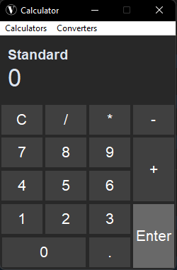
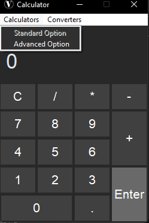
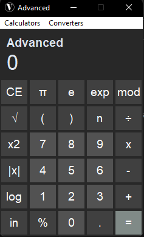
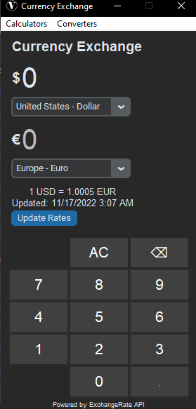
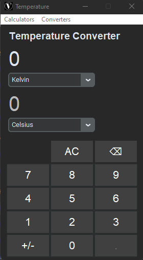

# full_calculator_gui_oop
A full working calculator I put together using OOP and CustomTkinter

My biggest project so far, almost 7000 lines of code and a full working calculator with three seperate options including the standard option(default),
advanced option, currency exchange option and temperature converter option all in one app.

This is the standard option of the calculator which is the dafault option. It does the basic calculations you would expect from a calculator.

The calculator has some options on the menu bar so the user can easily go between the four options the calculator provides.

This is the advanced option of the calculator. In this option you can do more advanced calculations including finding the square root of a number, the mod and expont.

This is the currency exchange option, I am using the ExchangeRate API for up to date rates. The user types in a number in the first 0 input and which ever 
currency they have selected will be exchanged on the bottom output. The currency exchange will be updated if they change currency after adding a number.

Finally, this is the temperature converter option, much like the currency exchange option and the same layout but without the use of an API and just some
standard class methods to do the convertering. 

